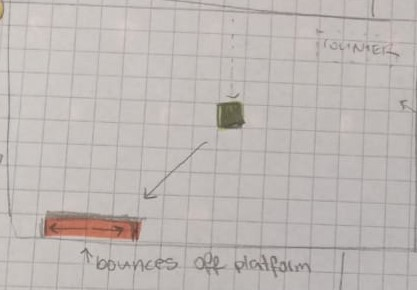

# Ballistic-iwag

The game Ballistic is a rather simple 2D Game. It consists of a ball and a platform, the goal is to not let the ball drop out of the screen's bottom edge. This is done by moving the platform on the x-Axis using the left and right arrowkeys, "catching" the ball and bouncing it back into the screen. Start and Retry button are clicked using the mouse/touchpad and direct you into the active game. 

My newest addition, a counter, allows you to see your current score! I am planning to expand this feature so you are also able to see that score in the game over screen.

Development Platform:
Win 10

Unity version: 2018.2.18f1

Visual Studio Version: 15.9.4

Target Platform:
Windows Standalone

Visuals: https://www.cse.iitb.ac.in/~shrey/img/02.png , except no bricks

Fonts I've used:

https://www.dafont.com/anarchy.font

https://www.dafont.com/jo-wrote-a-lovesong.font

https://fontmeme.com/fonts/scratch-font-font/

Tutorials I've used:

https://unity3d.com/de/learn/tutorials/topics/physics/bouncing-ball

https://www.youtube.com/watch?v=Emyx-54Oim4&t=213s

https://www.youtube.com/watch?v=WaDUUIo4iSw

https://www.youtube.com/watch?v=izl5VUm2Frk

progress - finished

idea: done 

concept: done

implementation: done

