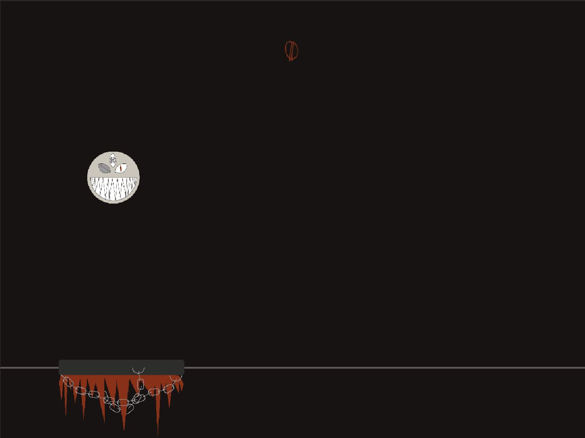

# Ballistic-iwag

The game Ballistic is a rather simple 2D Game. It consists of a ball and a platform, the goal is to not let the ball drop out of the screen's bottom edge. This is done by moving the platform on the x-Axis using the left and right arrowkeys, "catching" the ball and bouncing it back into the screen. Start and Retry button are clicked using the mouse/touchpad and direct you into the active game. 

My newest addition, a counter, allows you to see your current score! I am planning to expand this feature so you are also able to see that score in the game over screen.

--- 
## Want to try the game?

Well, look no further, a WebGL-Version can be found [here](https://www.sharemygame.com/share/4d999891-01b0-47db-bcf8-b37e429d6a15). Do keep in mind however that this is optimised for Windows Standalone resulting in somewhat awkward borders.

The character can be controlled by either using the left and right arowkeys or the a and d keys, respectively.

Or, in case playing is not for you, [here](https://youtu.be/JGouoljsAEY)'s the trailer.

---
### Specs:

##### Development Platform: 
Win 10

##### Unity version:
2018.2.18f1

##### Visual Studio Version: 
15.9.4

##### Target Platform:
Windows Standalone

##### Scripting Runtime Version:
.NET 3.5 Equivalent

##### API compatibility Level:
.NET 2.0 Subset

##### Reference Resolution:
1024px x 768px

---

### Visuals: 

like [so](https://www.cse.iitb.ac.in/~shrey/img/02.png) , except no bricks

Note: The link above shows the first version I had in mind, the current one can be seen at the very bottom of the readme. I am keeping this first visualisation nevertheless as it shows where I have drawn insipiration from.

### Fonts I've used:

[Anarchy](https://www.dafont.com/anarchy.font) 
-used for Buttons

[Jo Wrote A Lovesong](https://www.dafont.com/jo-wrote-a-lovesong.font) 
-used for headings

[Scratch](https://fontmeme.com/fonts/scratch-font-font/) 
-used for score

### Tutorials I've used:

[bounce material](https://unity3d.com/de/learn/tutorials/topics/physics/bouncing-ball) 
-used for ball

[movements](https://www.youtube.com/watch?v=Emyx-54Oim4&t=213s) 
-used for pedal movements

[buttons](https://www.youtube.com/watch?v=WaDUUIo4iSw) 
-used to start/retry game

[game over trigger](https://www.youtube.com/watch?v=izl5VUm2Frk) 
-pretty much self-explanatory

Furthermore, the Ball code is from [smeerws](https://github.com/smeerws).

---

progress - 105% finished

idea: done 

concept: done

implementation: done

---

### First Concept:

At this point, the game was still called "BouncyBall". Additionally, the graphics have been altered in order to fit in with the game's new and current name "Ballistic".

### Final Implementation:

Here, the updated graphics can be seen. The Screenshots are snippets straight from the final game.

##### #1 | "Welcome"

##### #2 | "Main"

##### #3 | "Game Over"

Additional Note: I've learnt to not underestimate simple things, even such that seem as foolproof as borders. Take your time and plan accordingly.

© by me
